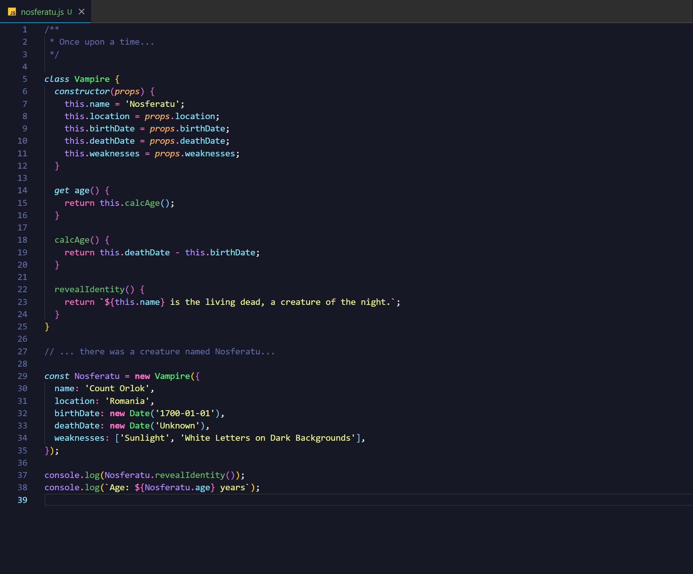
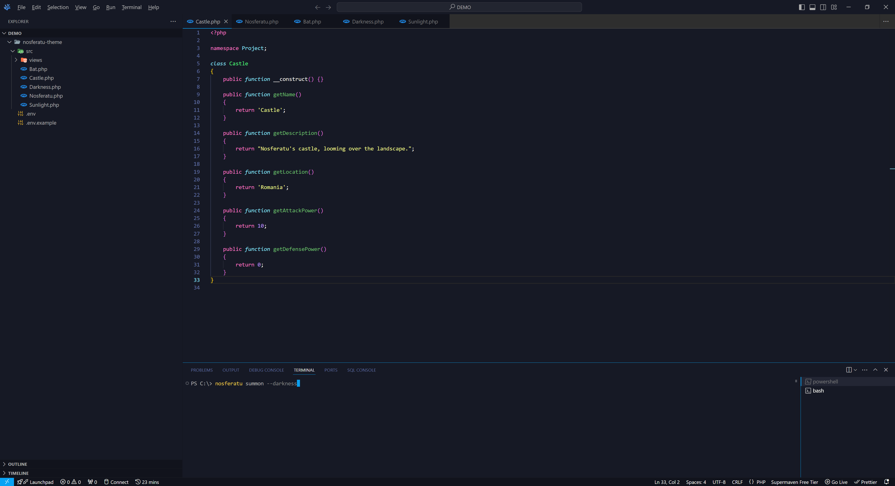

<h1 align="center">Nosferatu Theme</h1>

  
   
  <i>“Let us chat together a moment, my friend! There are still   several hours until dawn,  and I sleep during the day.”
    </i>
   

> A [Sweet Dracula](https://github.com/PROxZIMA/sweet-dracula)-inspired dark theme for [Visual Studio Code](http://code.visualstudio.com) and [VSCodium](https://vscodium.com/). The goal of the theme is to reduce eye strain during long coding sessions, by providing muted text colors on top of a blue-ish background.

<h3 align="center"><b>Text Editor</b></h3>

<h3 align="center"><b>Terminal</b></h3>

<h3 align="center"><b>General Look</b></h3>

## Features

- **Eye-Friendly Colors**: Gentle blue-ish background and muted text colors to minimize glare and reduce eye strain.
- **Enhanced Readability**: Soft contrast that helps maintain readability over extended periods of coding.

## Installation

To install the Nosferatu Theme for Visual Studio Code, follow these steps:

1. **Open Visual Studio Code.**
2. **Navigate to the Extensions view** by clicking on the Extensions icon in the Activity Bar on the side of the window or pressing `Ctrl+Shift+X`.
3. **Search for "Nosferatu Theme".**
4. **Click "Install"** on the Nosferatu Theme extension.

## Usage

1. **Activate the Theme:**
   - Open the Command Palette (`Ctrl+Shift+P` or `Cmd+Shift+P` on Mac).
   - Type "Color Theme" and select "Nosferatu".

2. **Customize (Optional):**
   - Adjust colors and settings to suit your preferences in the `settings.json` file.

## Contributing

If you'd like to contribute to this theme, please read the [contributing guidelines](./.github/CONTRIBUTING.md).

## License

This theme is licensed under the [MIT License](./LICENSE).
