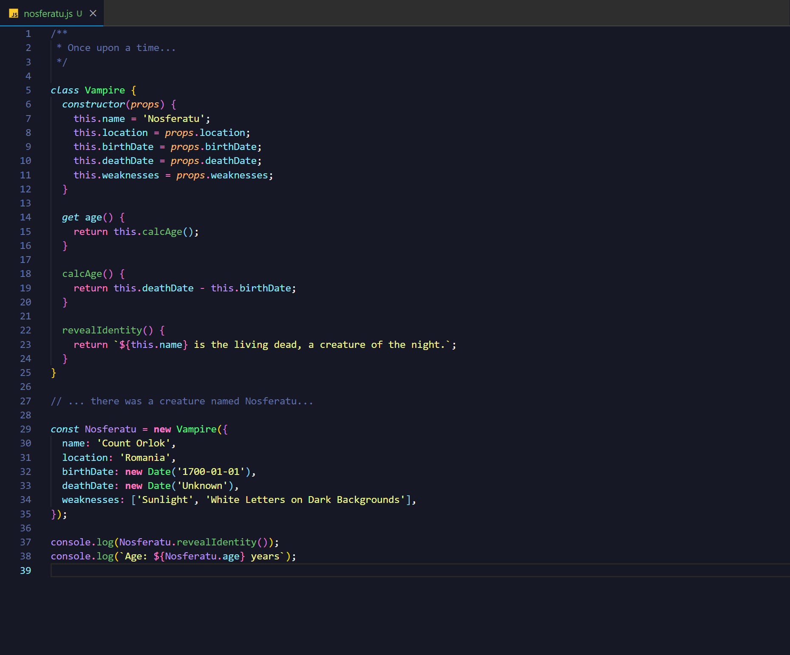
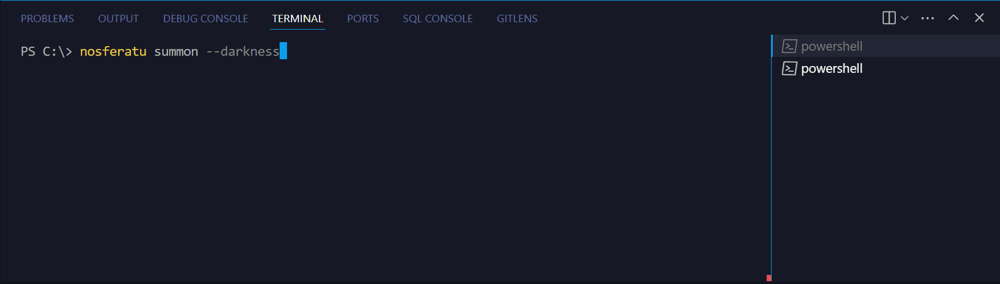
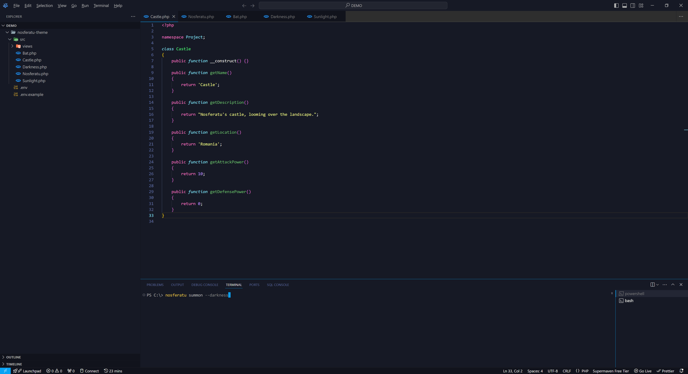

<h1 align="center">Nosferatu Theme</h1>

  
   
  <i>“Let us chat together a moment, my friend! There are still   several hours until dawn,  and I sleep during the day.”
    </i>
   

> Um tema escuro inspirado no [Sweet Dracula](https://github.com/PROxZIMA/sweet-dracula) para [Visual Studio Code](http://code.visualstudio.com) e [VSCodium](https://vscodium.com/). O objetivo do tema é reduzir a fadiga ocular durante longas sessões de código, com a exibição de cores de texto suaves sobre um fundo azulado.

<h3 align="center"><b>Editor de Texto</b></h3>

<h3 align="center"><b>Terminal</b></h3>

<h3 align="center"><b>Aparência Geral</b></h3>

## Destaques

- **Cores Amigáveis para os Olhos**: Fundo azul suave e cores de texto atenuadas para minimizar glare e reduzir fadiga ocular.
- **Legibilidade Aprimorada**: Contraste suave que busca ajudar com a legibilidade durante longas horas de código.

## Instalação

Para instalar o Nosferatu Theme para o Visual Studio Code/VSCodium, siga estes passos:

1. **Abra o Visual Studio Code.**
2. **Navegue até a visualização de Extensões** clicando no ícone de Extensões na Barra de Atividade, ou pressionando `Ctrl+Shift+X`.
3. **Busque por "Nosferatu Theme".**
4. **Clique em "Instalar"** na extensão do Nosferatu Theme.

## Uso

1. **Ative o Tema:**
   - Abra a Paleta de Comandos (`Ctrl+Shift+P` ou `Cmd+Shift+P` no Mac).
   - Digite "Tema de Cores" e selecione "Nosferatu".

2. **Personalizar (Opcional):**
   - Ajuste cores e configurações de acordo com suas preferências no arquivo `settings.json`.

## Contribuições

Se você gostaria de fornecer contribuições ao código, por favor, leia as [diretrizes de contribuição](./.github/CONTRIBUTING.md).

## Licença

Este tema é licenciado sob a [Licença MIT](./LICENSE).

